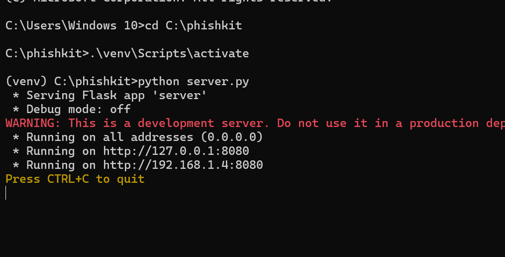

# 🎯 Ethical Phishing Simulation – For Educational Purposes Only

> ⚠️ **DISCLAIMER:** This tool is intended **strictly for educational use** to understand how phishing works and how to prevent it. Do **NOT** use this tool for illegal purposes.

---

## 📦 Clone the Project

Clone this repository to get started:

```bash
git clone https://github.com/your-username/ethical-phishing-sim.git
cd ethical-phishing-sim
```
*Replace the link above with your actual GitHub repository URL.*

---

## 🎯 Purpose

This project helps beginners and cybersecurity students learn and simulate a phishing attack in a controlled environment to build defense skills and awareness.

---

## 🛠️ Installation Steps

### 1. Prepare Your Environment

Make sure Python is installed.

Open your terminal and run:

```bash
cd C:\ethical-phishing-sim     # Or wherever you placed the folder
python -m venv venv
.\venv\Scripts\activate
```

### 2. Install Required Libraries

```bash
pip install flask
```

---

## 🚀 How to Start the Phishing Server

### Step 1: Activate and Run Python Server

```bash
cd C:\ethical-phishing-sim
.\venv\Scripts\activate
python server.py
```



### Step 2: Start ngrok Tunnel

Make sure `ngrok.exe` is downloaded and either:

- Placed in your project folder, or
- Added to your system PATH.

Then run:

```bash
cd C:\ngrok         # Or wherever ngrok.exe is located
ngrok http 8080
```


---

## 🌐 Public Access Link

ngrok will provide a link like:

```
https://xxxx-xxx-xxx.ngrok-free.app
```

✅ This link works across networks (not just on the same Wi-Fi).

⚠️ A warning page appears when someone opens the link — this is added by ngrok for user protection on the free plan and cannot be removed.

---

## 🧠 Educational Goals

- Understand how phishing kits are hosted.
- Learn Flask for form handling.
- Learn ngrok to expose localhost.
- Practice ethical hacking responsibly.
- Identify defense techniques against real phishing attacks.

---

## ✅ Responsible Use

- Only use for personal learning or in ethical hacking labs.
- Never ask others to input real credentials.
- Always inform anyone involved in the test.
- Report real phishing websites [here](https://safebrowsing.google.com/safebrowsing/report_phish/).

---

## 📚 Helpful Resources

- [Flask Official Docs](https://flask.palletsprojects.com/)
- [ngrok Docs](https://ngrok.com/docs)
- [OWASP Phishing Guide](https://owasp.org/www-community/Phishing)
- [TryHackMe – Phishing](https://tryhackme.com/room/phishing)

---

## 👨‍💻 Author

**Jomar** – Ethical hacking student learning to protect users through simulation.
