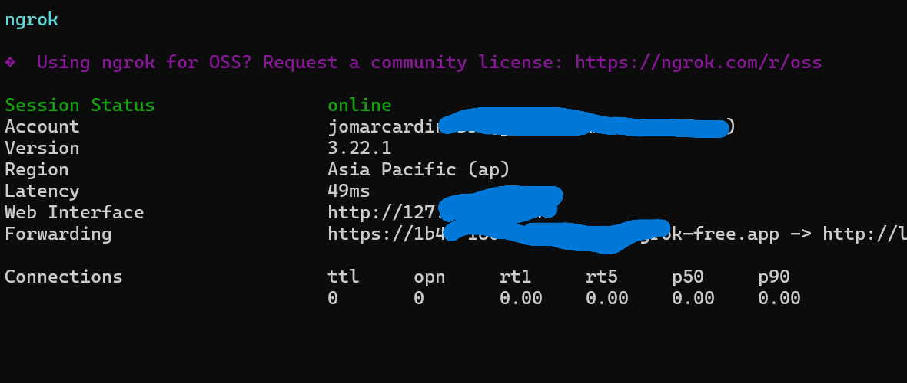

# Phishing Simulation 

> ⚠ **DISCLAIMER:** This tool is intended **strictly for educational use** to understand how phishing works and how to prevent it. Do **NOT** use this tool for illegal purposes.

---

##  Clone the Project

Clone this repository to get started:

```bash
git clone https://github.com/kujotaroooo/server.git
cd server.py
```
*Replace the link above with your actual GitHub repository URL.*

---

##  Purpose

This project helps beginners and cybersecurity students learn and simulate a phishing attack in a controlled environment to build defense skills and awareness.

---

## 🛠️ Installation Steps

### 1. Prepare Your Environment

Make sure Python is installed.

Open your terminal and run:

```bash
cd C:\server.py     # Or wherever you placed the folder
python -m venv venv
.\venv\Scripts\activate
```

### 2. Install Required Libraries

```bash
pip install flask
```

---

##  How to Start the Phishing Server

### Step 1: Activate and Run Python Server

```bash
cd C:\server.py
.\venv\Scripts\activate
python server.py
```


### Step 2: Start ngrok Tunnel

Make sure `ngrok.exe` is downloaded and either:

- Placed in your project folder, or
- Added to your system PATH.

Then run:

```bash
cd C:\ngrok         # Or wherever ngrok.exe is located
ngrok http 8080
```



---

##  Public Access Link

ngrok will provide a link like:

```
https://xxxx-xxx-xxx.ngrok-free.app
```

✅ This link works across networks (not just on the same Wi-Fi).


##  Author

**Jomar** 
